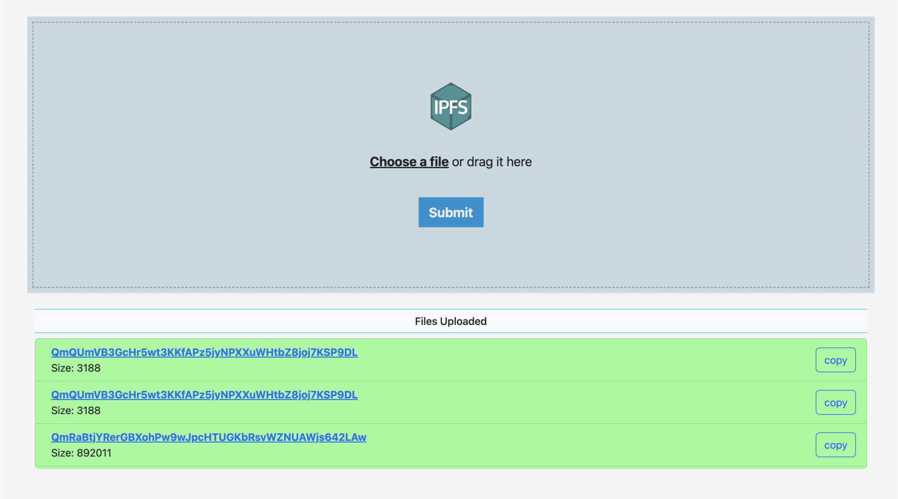

# DropChain
<p align="center">
    
    
</p>

Dropchain is a small **web application** aimed to give easy access to the tecnology of [*ipfs*](https://ipfs.tech/) with a simple interface to upload and share files.
This is a university project made for the 2022 edition of the Tecnologie Web (Web Technologies) course at the [*Università degli Studi di Napoli Parthenope*](https://github.com/uniparthenope).

| :exclamation:  This project was made for learning purposes only |
|-----------------------------------------------------------------|

## Table of Contents
- [Dependencies](#Dependencies)
- [Getting started](#getting-started)
  - [Installation](#installation)
  - [Quit and restart](#Quit-and-restart)
- [Tecnologies](#Tecnologies)
- [Open Source components](#Open-source-components)
- [License](#License)
- [Author information](#Author-Information)

## Dependencies
* Node(>16.0.0)
* npm(>=7.0.0)

## Getting started
### Installation
Open a terminal and clone this repository from `github` with the following command:

```
git clone https://github.com/StefanoVerrilli00/DropChain.git
```
`cd` into the directory `DropChain` and run the command below to install the dependencies (this will take some time):
```
npm install
```
then run the application with:
```
npm start
```
and connect to your `ipv4` address or the localhost at port 3000 (`http://localhost:3000/`)
<p align="center"></p>

### Quit and restart
To stop the application you just have to press `CTRL-C` on the terminal window. To restart it just run `npm start` in the DropChain directory

## Technologies
To build this app the following technologies have been used:
- HTML5
- CSS3 (Bootstrap)
- Javascript
- Node.js
- Ipfs-core(javascript implementation of IPFS)
- Express (Packege for routing)

## Open source components
- ipfs-core([LICENSE](https://github.com/ipfs/js-ipfs/tree/master/packages/ipfs-core#license))
- Bootstrap ([License](https://github.com/twbs/bootstrap/blob/main/LICENSE))
- Express([LICENSE](https://github.com/expressjs/express/blob/master/LICENSE))
- multer([LICENSE](https://github.com/expressjs/multer/blob/master/LICENSE))
- jquery([LICENSE](https://github.com/jquery/jquery/blob/main/LICENSE.txt))
- ejs([LICENSE](https://github.com/mde/ejs/blob/main/LICENSE))
- it(Licensed either under [MIT](https://github.com/achingbrain/it/blob/master/LICENSE-MIT) and [Apache](https://github.com/achingbrain/it/blob/master/LICENSE-APACHE))
- name2mime([LICENSE](https://github.com/imhashir/name2mime/blob/master/LICENSE))

## Assets
- public/files/logo-ipfs.png owned by [krl](https://github.com/krl) is s licensed under the Creative Commons Attribution-Share Alike 3.0 Unported license.
- The icons used are owned by [Font-awsome](https://github.com/FortAwesome/Font-Awesome) under [LICENSE](https://github.com/FortAwesome/Font-Awesome/blob/6.x/LICENSE.txt)

## License

Apache 2.0

## Author Information

- Stefano Verrilli [@stefanoVerrilli](https://github.com/StefanoVerrilli00)
